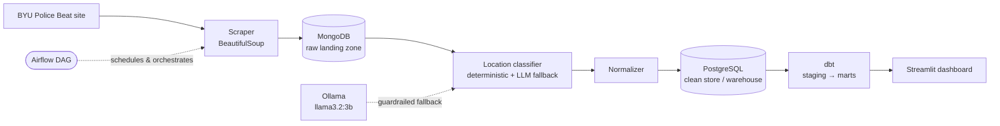

# Campus Safety Analytics Platform

**An end-to-end data pipeline that turns BYU's unstructured police-beat reports into a queryable, location-aware campus safety warehouse — scraped, classified with a local LLM, modeled with dbt, and served through a dashboard. Every service runs in a container.**

[](https://github.com/spdavis5/campus-crime-data-pipeline/actions/workflows/ci.yml)


## Architecture



*Every box is its own Docker container, wired together by a single `docker-compose.yml`. Airflow (opt-in) runs the scrape → classify → normalize → dbt chain on a schedule.*

## The problem

BYU publishes a daily "Police Beat" — a page of short, free-text incident narratives ("Officers responded to a fire alarm at the HBLL…"). It's human-readable but analytically useless: no structure, no location field, no way to ask *where* on campus incidents cluster or *when* they spike. This pipeline ingests those narratives, extracts a **campus zone** and **date** from each, loads them into a dimensional warehouse, and serves trends by location and academic-calendar context. It has processed **6,454 incidents across roughly four years (2022–2026)**, classifying the majority to a campus zone with high precision, and surfaces findings like *incidents rise during finals week (5.4/day vs 4.1 on regular days) and fall over academic breaks (3.9/day).* *(Metrics as of July 2026; the dataset grows as the pipeline runs.)*

## Tech stack & why

| Layer | Choice | Why |
|---|---|---|
| Ingestion | Python + **BeautifulSoup** | The source is server-rendered HTML with no API; hash-based incremental loading keeps re-scrapes idempotent. |
| Raw store | **MongoDB** | Scraped incidents are semi-structured documents with placeholder enrichment fields; a document store is the natural landing zone before relational modeling. |
| Classification | **Ollama** running **llama3.2:3b**, locally | Local inference means $0 cost and no data leaving the machine. Used as a *guardrailed fallback*, not the primary classifier (see below). |
| Clean store / warehouse | **PostgreSQL** | A proper relational model (`beats`, `incidents`, `incident_dates`) for the serving layer and dbt target. |
| Transformation | **dbt** | Staging → marts with a star schema (`fct_incidents` + `dim_date` / `dim_location` / `dim_incident_type`), plus data tests and generated docs. |
| Orchestration | **Airflow** | Schedules the full chain as a DAG using the `DockerOperator`, so each stage runs as the same container you'd run by hand. |
| Serving | **Streamlit** | Makes the invisible pipeline tangible: zone heatmap, trend lines, and calendar-context breakdowns. |
| Reproducibility | **Docker Compose** | One file defines every service; the whole platform comes up from a clean checkout. |

## The location classifier (the interesting part)

The hardest problem is that incident text names locations inconsistently ("the HBLL", "Lot 41", "Heritage Halls", "HR #12") — and **a large share of reports state no location at all**. The classifier is a **hybrid, deterministic-first** design:

1. **Deterministic lookup** — an ordered alias table (~80 building names/codes) and a parking-lot→zone map resolve every explicitly named place. High precision, fully reproducible, no model involved. Resolves **~54%** of incidents on its own.
2. **Local LLM fallback** — only runs on lookup misses, with a prompt engineered to **abstain** (return `UNKNOWN`) unless it reads an explicit building name.
3. **Guardrail** — if the model proposes a zone but the text names no proper place, the answer is overridden to `UNKNOWN`. This is what stops the model inventing a location from context.

The result: the deterministic layer locates ~54% of incidents with no model call, the guardrailed LLM fallback lifts fully-classified data toward **~67% located with zero fabrications**, and everything else becomes an honest `UNKNOWN`.

### How I built this — where the AI was wrong, and how I corrected it

The original plan was "LLM classifies each incident into a campus zone." Before building the pipeline around it, I ran a **validation spike** on real data. The raw model:

- returned `MEDIUM` confidence on **all 30** test incidents and **never once abstained**;
- **fabricated** a plausible zone (with confident-sounding reasoning) for incidents that named no location at all;
- conflated real places — the *Marriott Center* (arena) with the *Marriott School* (business).

Measuring the full dataset showed the root cause: locations are stated as **explicit building names**, not the fuzzy phrasing an LLM is needed for, and **57% of reports have no location to extract**. So I redesigned around a **deterministic lookup**, demoted the LLM to a **guardrailed fallback**, and used it as a *discovery tool* — running it over the data and promoting every real building it surfaced into the deterministic table. Fabrications went from ~all to **zero**, and coverage rose to the data's real ceiling. Documenting that failure-and-correction was more valuable than any clean success would have been. The classifier runs are cached (never re-classified), so the local model is only ever invoked once per incident.

## Data quality & testing

- **Unit tests** (`pytest`) cover the classifier's deterministic layer and guardrail with a fake LLM, pinning down specific regressions (Marriott Center ≠ business, `HR #` = Heritage, non-breaking-hyphen normalization, `esc` not matching "rescue", unknown lots not guessed), plus the normalizer's transform logic.
- **dbt tests** enforce warehouse integrity: `unique`/`not_null` on primary keys, and `relationships` tests tying `fct_incidents` to every dimension.
- **Source-data defenses**: some beat titles contain typo'd years (e.g. `06/22/2005` for 2025, `20203` for 2023). Rather than corrupt the timeline, the staging layer treats any incident whose date span exceeds a month as a source typo and attributes it to the most recent date in the range — keeping the raw store untouched while the analytical dates stay sane.
- **CI** (GitHub Actions) runs the full test suite and a `dbt build` against a Postgres service on every push and PR.
- **Fail-loud connections**: every store (Mongo, Postgres, Ollama) verifies reachability on startup and exits with a clear message rather than hanging.

## Run it

Everything runs in containers. From a clean checkout:

```bash
# 1. Bring up the stores and pull the local model (first run downloads llama3.2:3b)
docker compose up -d mongodb postgres ollama

# 2. Run the pipeline stages (each is a containerized job)
docker compose run --rm scraper --max-pages 5   # scrape into MongoDB
docker compose run --rm classifier              # classify incidents into zones
docker compose run --rm normalizer              # load the clean store in Postgres
docker compose run --rm dbt build               # build + test the warehouse

# 3. Open the dashboard
docker compose up -d dashboard                  # http://localhost:8501
```

Or schedule the whole chain with Airflow:

```bash
docker compose --profile airflow up -d          # http://localhost:8080  (admin / admin)
```

## Project structure

```
scraper.py              # HTML scrape → incident documents (idempotent, hash-deduped)
mongo_store.py          # MongoDB raw landing zone
classifier/             # hybrid location classifier
  reference.py          #   zones, landmark alias table, parking-lot map
  core.py               #   normalization, deterministic lookup, guardrail, orchestration
  llm.py                #   Ollama fallback with abstention prompt
  runner.py             #   batch job over the raw store (cached)
normalizer/             # Mongo documents → relational rows
postgres_store.py       # PostgreSQL clean store / dbt target
dbt/                    # staging → marts star schema, tests, seeds (academic calendar)
dashboard/              # Streamlit serving layer
airflow/dags/           # DAG orchestrating the full chain via DockerOperator
tests/                  # pytest suites
ci/fixtures.sql         # synthetic source data so dbt builds in CI
docker-compose.yml      # every service, one file
```

## Results & metrics

*As of July 2026; the dataset grows each time the pipeline runs.*

- **6,454 incidents** ingested across ~4 years (**2022–2026**), deduplicated by content hash.
- **12 campus zones**; the deterministic layer locates **~54%** with no model call, the guardrailed LLM fallback lifts fully-classified data toward **~67%**, and the rest is an honest **`UNKNOWN`** — with **0 fabricated** locations.
- **36 dbt nodes** (models + tests) build green in CI.
- **Finding:** across four years, finals week averages **5.4 incidents/day** vs **4.1** on regular class days and **3.9** during breaks — activity rises under finals-week stress and falls when campus empties.

## Design decisions & trade-offs

- **Precision over coverage.** A wrong zone corrupts every downstream aggregate, so unresolved incidents become `UNKNOWN` rather than a guess. The 33% unknown rate is a property of the data (most reports simply don't state a location), not a defect.
- **Deterministic-first, LLM-second.** For this data, explicit building names make a lookup table *more* accurate and reproducible than an LLM — and free. The model earns its place only on the genuinely ambiguous remainder.
- **MongoDB then PostgreSQL.** Raw semi-structured capture is decoupled from the clean relational model, so a re-classification or schema change never requires re-scraping.
- **Local model over a hosted API.** Zero cost, full privacy, and reproducible from a clean checkout — at the price of a one-time model download.

## What I'd improve

- **Game-day analysis.** `dim_date` already carries an `is_game_day` flag; it needs BYU's athletic home-game schedule seeded as `GAME_DAY` rows to light up.
- **Multi-date attribution.** Multi-day beats keep every candidate date; a smarter model could narrow which day an incident actually occurred.
- **Backfill + incremental dbt.** The current warehouse rebuilds fully; incremental materializations would scale it to years of history.
- **A hosted demo.** The dashboard is local-only today; a deployed read-only instance would make the results browsable without running the stack.

## AI assistance

Built with AI assistance for scaffolding and iteration. The architecture, the classifier's hybrid redesign, the validation methodology, and all engineering judgment are my own; every generated component was reviewed, tested, and — in the classifier's case — measured against real data and corrected.

## License

MIT — see [LICENSE](LICENSE).
